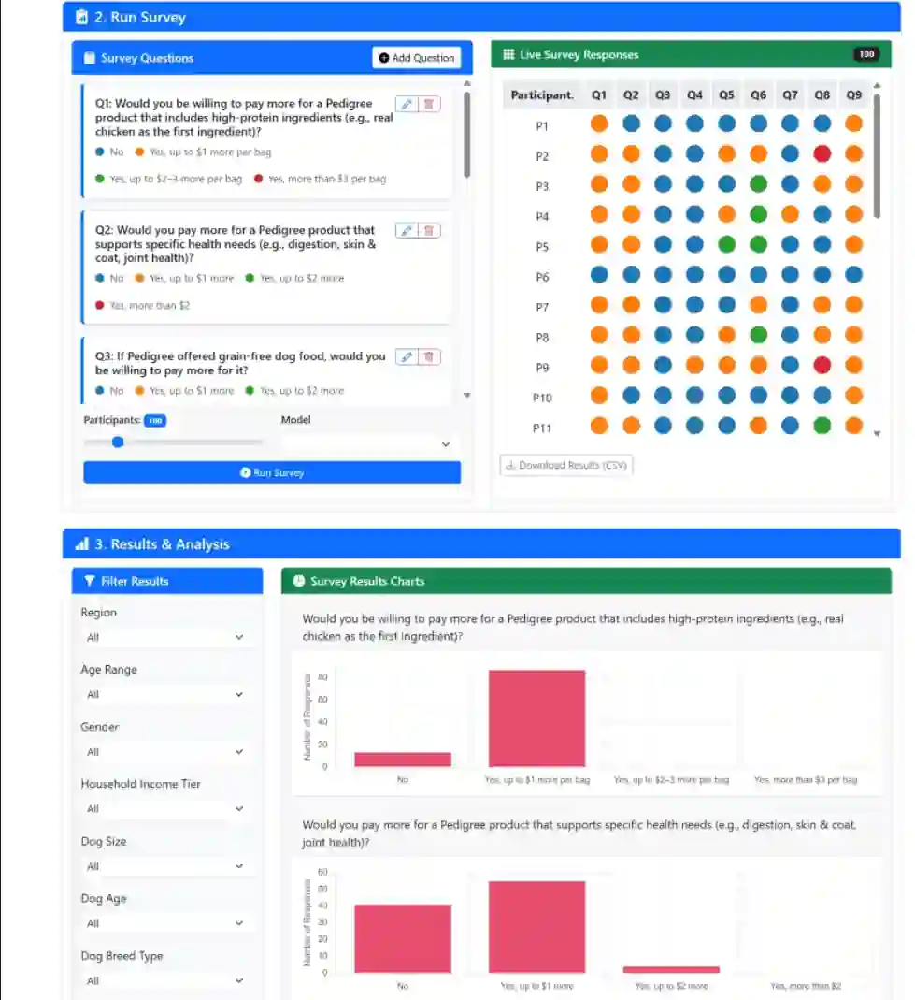
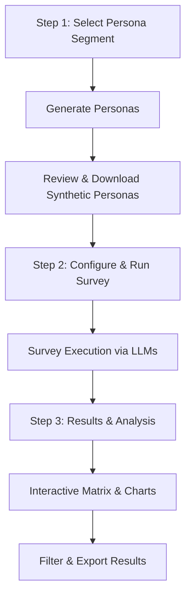

# Synthetic Persona Survey Demo

A comprehensive tool to generate synthetic personas, run surveys through LLMs, and analyze results—all within a clean, interactive interface.

---

## **Features**

* **Persona Generation:** Create realistic synthetic personas tailored to different segments with configurable fields.
* **Survey Execution:** Run customized surveys on generated personas using LLM-driven natural responses.
* **Interactive Visualization:** Visualize survey results with an OMRC matrix and detailed reasoning tooltips.
* **Dynamic Filtering & Analysis:** Filter results dynamically and explore data with interactive charts and tables.
* **Code Generation & Execution:** Automatically generate and run JavaScript code to create personas.
* **Dark/Light Mode Support:** Toggle between themes for optimal viewing comfort.
* **Demo Mode:** Load sample demos to quickly explore capabilities.

---

## **How It Works**

The process follows a guided 3-step workflow:

1. **Select Persona Segment:** Pick a persona category from predefined segments or customize fields.

2. **Generate Personas:** The system uses LLM-powered code generation to create a set of synthetic personas matching the selected profile.

3. **Run Survey:** Define survey questions and simulate authentic answers from personas through LLM interaction.

4. **Results & Analysis:** Review detailed survey responses with visual matrices, charts, and data filtering.

5. **Export Data:** Download personas and survey results in CSV format for further use.

---

## **UI/UX Overview**

* **Clean, responsive layout:** Uses Bootstrap for mobile-friendly, adaptive design.
* **Step-by-step sections:** Each step has its own card interface with progress indicators.
* **Collapsible code & schema views:** Easily inspect generated code and JSON schemas.
* **Tooltip-enhanced matrix:** Hover over circle cells to reveal full participant reasoning.
* **Dynamic legend:** Collapsible, scrollable legend describing survey options.

---

## **Technologies Used**

* **Frontend:** HTML5, CSS3, JavaScript (ES modules), Bootstrap 5, Bootstrap Icons
* **Visualization:** D3.js for matrix rendering, Chart.js for charts
* **LLM integration:** Uses `bootstrap-llm-provider` for OpenAI-compatible API calls
* **Code generation & execution:** Dynamic JavaScript generation and safe execution in-browser
* **Data handling:** JSON, CSV export functionality

---

## **Getting Started**

1. Clone or download this repository.
2. Open `index.html` in a modern browser.
3. Configure your API provider via the **Configure API Provider** button.
4. Select a persona segment and configure generation parameters.
5. Generate personas and execute the survey.
6. Explore the results, apply filters, and export data as needed.

---

## **Development**

**Code structure and key files:**

* `index.html` — Main HTML structure and UI skeleton.
* `script.js` — Core JavaScript logic for persona generation, survey management, and rendering.
* `segments.json` — Sample segment data defining persona profiles.
* `demos/` — Demo data and configurations for quick loading.
* External dependencies loaded via CDN (D3.js, Bootstrap, Chart.js, bootstrap-llm-provider).

### **Key Details**

* Dynamic model loading based on configured LLM provider.
* Progressive batch processing for survey simulation.
* Robust error handling with user-friendly modals.
* Asynchronous UI updates with smooth progress bars.
* Reusable components for filters and charts.
* Responsive design with dark and light theme compatibility.

---

**Enjoy synthetic persona generation and survey analysis powered by LLMs!**
